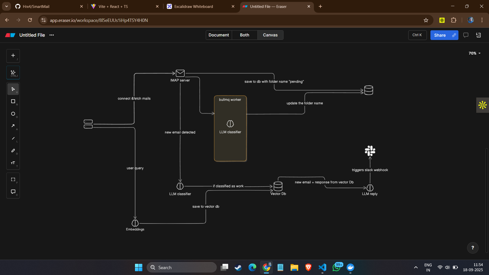

# 📧 SmartMail – Intelligent Email Aggregator

SmartMail is a full-stack email management system that aggregates, classifies, and enhances user emails with AI-powered features.  
It supports multiple IMAP accounts, Gmail-like rendering, real-time categorization, and smart email replies.  

---

## 🌟 Features
- 🔗 **Multi-Account Aggregation**: Connect and sync multiple IMAP email accounts in real-time.  
- 🗂️ **Intelligent Categorization**: Emails are automatically sorted into Work, Personal, Spam, Newsletters, etc., using **LLMs (Ollama / Llama 3.2)** with **Redis + BullMQ workers**.  
- 🤖 **Smart Email Replies**: AI generates context-aware suggested responses using stored embeddings and vector similarity.  
- 🔍 **Search & Filter**: Retrieve emails by sender, subject, or date with plans for semantic vector search integration.  
- 🔒 **Secure Authentication**: OAuth-based sign-in ensures user privacy and account security.  
- 🖥️ **Modern UI**: Built with **React.js** for a clean, Gmail-like interface with responsive design.  

---

## 🏗️ Architecture Overview
SmartMail follows a scalable and modular design:  

1. **Frontend**:  
   - Built with **React.js (TypeScript)**  
   - Secure OAuth login  
   - Search, filter, and Gmail-like email rendering  

2. **Backend**:  
   - **Node.js + Express.js** REST APIs  
   - **BullMQ + Redis** for background jobs (email fetching, classification, reply generation)  
   - **MongoDB** for email storage, metadata, and embeddings  

3. **AI & LLM Integration**:  
   - **Ollama (Llama 3.2)** for classification and reply suggestions  
   - Embeddings stored in DB for semantic similarity  

---

## 📸 Screenshots  

- **Landing Page**  
  

- **Inbox View**  
    

## 🗺️ System Architecture  

  

---

## ⚙️ Tech Stack  

- **Frontend**: React.js, TypeScript  
- **Backend**: Node.js, Express.js  
- **Database**: MongoDB  
- **Queue & Jobs**: BullMQ, Redis  
- **AI**: Ollama (Llama 3.2)  
- **Auth**: OAuth2  

---

